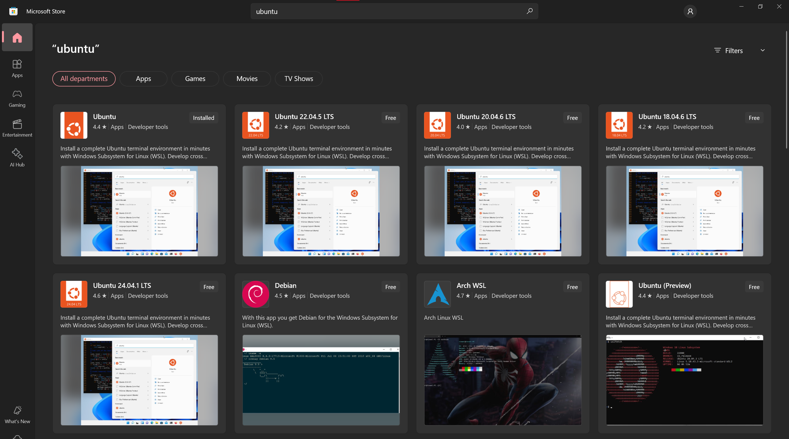

<p align="Center">
    
</p>

---

# How to host Supabase locally on Windows using WSL and Ubuntu CLI Environment

This Repository is a guide on how to host Supabase Locally using WSL and Ubuntu CLI Environment. The repo is open for acquiring issues and concerns and glad to help regarding with that and also for everyone.

## Why use WSL if we have Docker Desktop to host Supabase Locally?
Well, also tried supabase using docker desktop on windows but again i run to many errors regarding running the container. Thats why i decided to use WSL and Ubuntu to solve my problem. This also i would to share my experience. (I'm beginner so please bare with me)

## Requirements before continue to the guide.
List of Requirement we need in order to pull this off are the following below:

- You need to have Windows 10 and later with a version of 2004 and higher (Build 19041 and higher) or Windows 11 to use the commands below. (To identify the version of your machine use the run command and type `winver`)
- Make sure you have strong connection to the internet.
- Enough Space.
- Enable the Virtualization to your BIOS/UEFI Firmware settings. Make sure to check it and enable it.
- For x64 systems: Version 1903 or later, with Build 18362.1049 or later.

For more information about the requirements make sure you also check this [guide](https://learn.microsoft.com/en-us/windows/wsl/install) from Microsoft its also included the installation of WSL.

## A quick heads up before we start
Before we start the installation, I would like to give a quick glance about my machine i'm using and the conditions you should also consider:
- I'm using Macbook Pro Late 2013 using Bootcamp to run Windows 10
- I also tried to my desktop and it works perfectly fine as well. The specs with Ryzen 3 3200G (IDK if this is enough)
- In this guide we will be doing a Manual Install of WSL since most of the people encountered an people including me running some errors when doing the native way.

# Installation Step-by-Step
## 1. Enable the Windows Subsystem for Linux
Open-up your Windows Powerhell and run as administrator and paste the command.

```md
dism.exe /online /enable-feature /featurename:Microsoft-Windows-Subsystem-Linux /all /norestart
```


after the command execution you may restart your machine and open-up the Windows Powershell wile running as administrator

## 2. Enable the Virtual Machine Feature
You may paste this command below, this command will enable the Virtualization to your machine

```md
dism.exe /online /enable-feature /featurename:VirtualMachinePlatform /all /norestart
```


and again restart your machine

## 3. Download the Linux kernel update package
You may need to install this [package](https://wslstorestorage.blob.core.windows.net/wslblob/wsl_update_x64.msi) from microsoft.

## 4. Setting up WSL Version 2 as your default version
Paste tihs command to Windows Powershell. when installig a new linux distribution.

```md
wsl --set-default-version 2
```


## 5. It's time to install your Linux Distribution of choice
After setting up to Powershell moving on to Microsoft Store and choice your Linux Distro (in this guide we will be using Ubuntu LTS) and install it



## 6. Setup up your Ubuntu CLI Environment!
Open up Ubuntu you've just installed and it will take up sometime to set things up, after it will ask for the username and password which you need to provide.


## 7. Use brew to install Docker
Once its done you need to install brew for us to able to download docker and supabase

```md
/bin/bash -c "$(curl -fsSL https://raw.githubusercontent.com/Homebrew/install/HEAD/install.sh)"
```

## 8. Install Docker using homebrew
Paste this command to install docker, we need this first to install before installing supabase
```md
brew install docker
```

## 9. Install Supabase
Paste this command to install supabase. It final comes to the final installation
```md
brew install supabase/tap/supabase
```

## 10. Setup our very first supabase locally
Create an directory where you will place the supabase init
```md
mkdir my_local_supabase
```

Go to inside of you directory you've just made
```md
cd my_local_supabase
```

Use Supabase Login to access the and give our machine an token so we can run it.
```html
supabase login
```

This will redirect to the site (or just copy the link) and it will need to enter the code you have from the site to the cli. This generates a token and it will allow you know to create init.

Use this command to initialize our very first project

```html
supabase init
```

This may take sometime because it will install all the images it needs from docker to run supabase. After installation of it you can now use to start our supabase locally
```html
supabase start
```


If you happened you don't know the username and password

username = postgres
password = password
database = ```empty```

to check your studio use te studio link given to the picture.

## 11 Use Supabase as database to Laravel
Install Laravel Breeze
```md
composer require laravel/breeze --dev
```

After Composer has installed the Laravel Breeze package, you should run the breeze:install Artisan command. This command publishes the authentication views, routes, controllers, and other resources to your application.

```md
php artisan breeze:install
 
php artisan migrate
php artisan serve
```

And try to open the application to give it a try to login and register to the website without giving an error.

and there you have it guys, i hope you guys find this a helpful one. If you found any issues, suggestion, or feedback feel free to contact me. (I'm a beginner so please bare with me).
